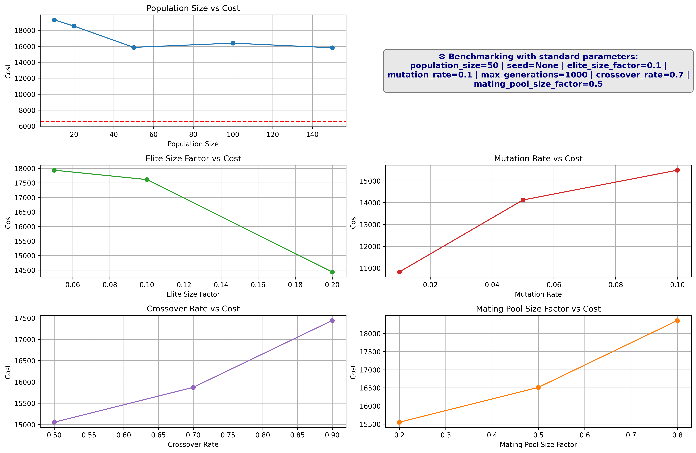

# Traveling Salesman Problem - Evolutionary Algorithm Solver

*A Python project for solving the Traveling Salesman Problem using an evolutionary algorithm*

---

## Table of Contents
- [Problem Description](#problem-description)
- [How the Evolutionary Algorithm is Used](#how-the-evolutionary-algorithm-is-used)
- [Project Features](#project-features)
- [Configuration](#configuration)
- [Usage](#usage)
  - [Running Benchmark Mode](#running-benchmark-mode)
  - [Running Single Solution Mode](#running-single-solution-mode)
- [Output](#output)
- [Dependencies](#dependencies)
- [License](#license)

---

## Problem Description

The **Traveling Salesman Problem** is a classic combinatorial optimization problem:
- Given a set of cities and the distances between each pair, the task is to find the shortest possible route that visits every city exactly once and returns to the starting city.
- The problem is NP-hard, so exact solutions become impractical for large numbers of cities. Heuristic and metaheuristic methods like evolutionary algorithms are useful to find good approximations.

## How the Evolutionary Algorithm is Used

The evolutionary algorithm works as follows:
- Each individual in the population represents a possible tour (a permutation of the cities).
- The algorithm starts with a population of random tours.
- In each generation:
  - **Selection**: The best tours are selected to form the next generation.
  - **Crossover**: New tours are generated by combining parts of parent tours.
  - **Mutation**: Small random changes are applied to tours to maintain diversity.
- This process repeats until a stopping condition is met (e.g. a maximum number of generations).

## Project Features

- Two main modes: **Benchmark** and **Single Solution**
- Easily configurable parameters (population size, mutation rate, crossover rate, elite size, number of generations, etc.)
- Performance graphs and convergence plots
- Simple and clear output for best solution
- Modular code structure for easy extension

## Configuration

All parameters, including:
- Population size
- Mutation rate
- Crossover rate
- Number of generations
- Elite size

...and other settings can be modified easily in the **`config/`** folder.

---

## Usage

Clone the repository:

```bash
git clone https://github.com/re-pixel/TravelingSalesman.git
cd TravelingSalesman
```

Adjust parameters in the `config/` folder as needed. All algorithm settings (e.g. population size, mutation rate, crossover rate, elite size, number of generations) can be modified there.

### Running Benchmark Mode
This mode runs multiple executions to evaluate performance and generates graphs of the results:

```bash
python main.py --mode benchmark
```

### Running Single Solution Mode
This mode runs the evolutionary algorithm once and shows the best solution found:

```bash
python main.py --mode single
```

---

## Output

- **Benchmark mode:** Saves performance graphs (performance comparisons for different parameter values) to the project directory.

  <p align="center">
    
  </p>

- **Single solution mode:** Prints the best route and its total distance to the console.

---

## Dependencies

Install required packages:

```bash
pip install -r requirements.txt
```

---

## License

This project is open source and available under the MIT License.

---
